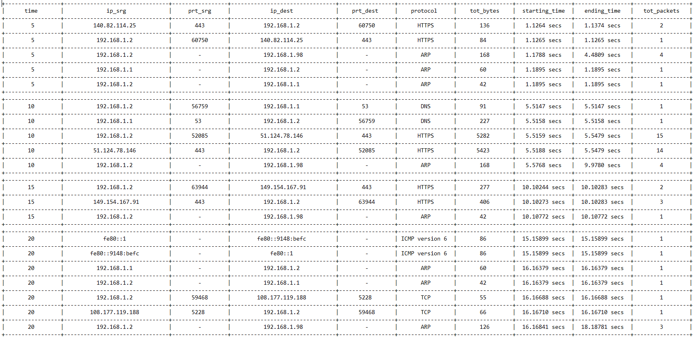
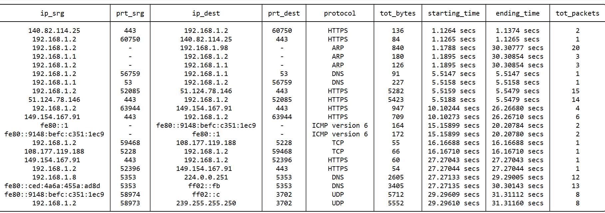

# Network-Analyzer

> Project developed for the System and Device Programming course of Politecnico di Torino by Cristina Biasi (281936), Giulia D'Ascenzi (287720) and Patrizio De Girolamo (292497)

## Overview

The purpose of this project is to provide a multiplatform application capable of intercepting incoming and outgoing traffic through the network interfaces of a computer.
During the sniffing process the application periodically updates a report containing a synthesis of the observed events.

## Features

This is a [Rust](https://www.rust-lang.org/it) application that uses [libpnet](https://docs.rs/pnet/latest/pnet/) as a support in the capture and manipulation of packets. Such library provides modules and crates that allow to easily parse packets up to transport layer. Additional implementation of application level parsing methods can be found in [packet_handle.rs](https://github.com/patriziodegirolamo/Network-Analyser/blob/main/src/packet_handle.rs) module.

#### Selection of Network Adapter

The application allows to select the network interface through which the traffic will be observed. This will be set in promiscuous mode so that all incoming and outgoing packets are captured.

#### Protocols Management

It provides methods to handle the following protocols:

- Data Link Layer: Ethernet
- Network Layer: IPv4, IPv6, ARP, ICMPv4, ICMPv6
- Transport Layer: TCP, UDP
- Session Layer: TLS
- Application Layer: DNS, HTTP, HTTPS

#### Application of Filters

You can choose to filter the captured data based on:

- Source IP address
- Destination IP address
- Source port
- Destination port
- Protocol (among the list above)

One or more of these filters can be applied at once.

#### Record Statistics

It is possible to generate two output files, providing two types of sniffing statistics:

- Traffic observed in each **time interval**: 

  For each **network address/port** pair, the traffic sniffed is detailed in terms of **highest layer protocol**  transported, **cumulated number of bytes** transmitted, **timestamps** of the first and last occurrence of information exchanged and **cumulated number of packets** intercepted.  

  *Example of portion of report with time_interval = 5 s:*

  

- Summary of the traffic observed during the whole sniffing process. It is computed at the end of the process.

​		*Example of final report over a total time period of 31 s:*



## Getting Started

You need to have a working Rust environment and install [Npcap](https://npcap.com/) on Windows or Libpcap if you're using Linux on your machine.

#### Windows

To install Npcap:

- Download the Npcap latest installer and the Software Development Kit (SDK) from [here](https://npcap.com/#download)
- Install Npcap
- Extract SDK zip and place folder's `/Lib/x64` absolute path in the `%LIB%` environment variable.

#### Linux

Install Libpcap running command `sudo apt install libpcap-dev`.

#### MacOS

Libraries are already installed by default.

## How to run

The project provides a sample application called [main.rs](https://github.com/patriziodegirolamo/Network-Analyser/blob/main/src/main.rs) that shows the main features of the implemented library. To run it, first of all clone it locally. 

#### Windows

- Open the terminal as administrator and place in the project directory
- Run `cargo build` to generate the executable
- Run the executable with command `start target/debug/traffic_analyser`

#### Linux/MacOS

- Place in project directory and run `sudo cargo build`
- Run the executable with command `sudo target/debug/traffic_analyser`

## Usage

 Running the sample application, the console will ask to provide some input values:

- The network interface to be sniffed
- The time interval after which an updated version of the report of the observed traffic will be generated
- The name of the file that will contain such report
- Possible filters to apply to captured packets

*Example of execution in Windows:*


These values will be used to initialize the fields of a NetworkAnalyser object, which will manage all the sniffing process:

```rust
na.init();	// Customize parameters
na.start();	// Start the sniffing process
```

It is possible to temporarily pause and subsequently resume the sniffing process, as well as to terminate the application providing meaningful input commands on the console (**p** for pausing, **r** for resuming, **x** for quitting):

```rust
na.pause();    // Pause
na.resume();   // Resume
na.quit();     // Quit
```

​		
