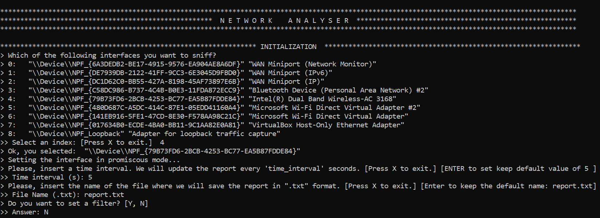

# Network-Analyzer

> Project developed for the System and Device Programming course of Politecnico di Torino.

## Overview

The purpose of this project is to provide an application to sniff and record the incoming and outgoing traffic of a computer network interface.

## Dependencies

This is a [Rust](https://www.rust-lang.org/it) application that uses [libpnet](https://docs.rs/pnet/latest/pnet/) as a support in the capture and manipulation of packets. Such library provides modules and crates that allow to easily parse packets up to transport layer. Additional implementation of application level parsing methods can be found in [packet_handle.rs](https://github.com/patriziodegirolamo/Network-Analyser/blob/main/src/packet_handle.rs) module.

#### Windows

To run it in Windows:

- Download the Npcap latest installer and the Software Development Kit (SDK) from [here](https://npcap.com/#download)
- Install Npcap
- Extract SDK zip and place folder's `/Lib/x64` absolute path in the `%LIB%` environment variable.

#### Linux

To run it on Linux, install Libpcap running command`sudo apt install libpcap-dev`.

#### MacOS

Libraries are already installed by default.

## Installation

To run this project, clone it locally. 

#### Windows

- Open the terminal as administrator and place in the project directory
- Run `cargo build` to generate the executable
- Run the executable with command `start target/debug/traffic_analyser`

#### Linux/MacOS

- Place in project directory and run `sudo cargo build`
- Run the executable with command `sudo target/debug/traffic_analyser`

## Usage

The project provides a sample application called [main.rs](https://github.com/patriziodegirolamo/Network-Analyser/blob/main/src/main.rs) that shows the main features of the implemented library. 

Running it, the console will ask to provide some input values:

- The network interface to be sniffed
- The time interval after which an updated version of the report of the observed traffic will be generated
- The name of the file that will contain such report
- Possible filters to apply to captured packets

*Example of execution in Windows:*



These values will be used to initialize the fields of a NetworkAnalyser object, which will manage all the sniffing process:

```rust
na.init();	// Customize parameters
na.start();	// Start the sniffing process
```


It is possible to temporarily pause and subsequently resume the sniffing process, and to terminate the application as well providing meaningful input commands on the console (**p** for pausing, **r** for resuming, **x** for quitting):

```rust
na.pause().unwrap();    // Pause
na.resume().unwrap();   // Resume
na.quit().unwrap();     // Quit
```

### Report Files

Two output files are generated, providing two types of sniffing statistics:

- File *report.txt* lists the traffic observed in each **time interval**: 

  For each **network address/port** pair, the traffic sniffed is detailed in terms of **highest layer protocol** transported, **cumulated number of bytes** transmitted, **timestamps** of the first and last occurrence of information exchanged and **cumulated number of packets** intercepted.  

  *Example of portion of report with time_interval = 5 s:*

  

- File *final_report.txt* summarize the same informations observed during the whole sniffing process.

​		*Example of final report over a total time period of 31 s:*


​		
